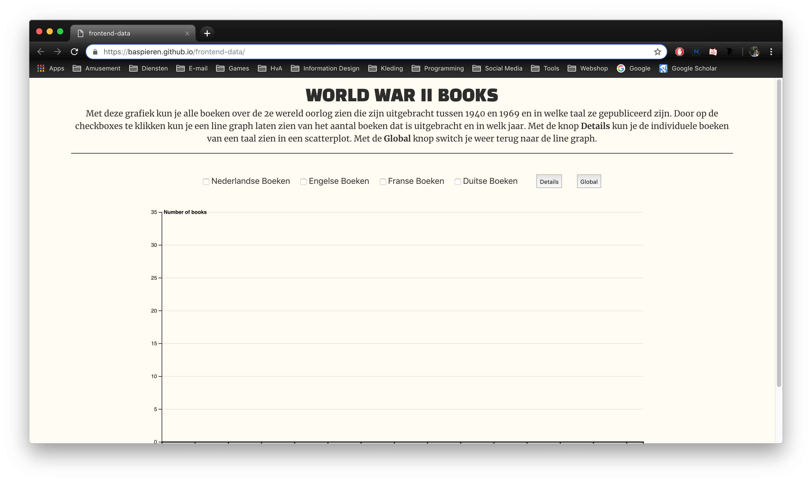
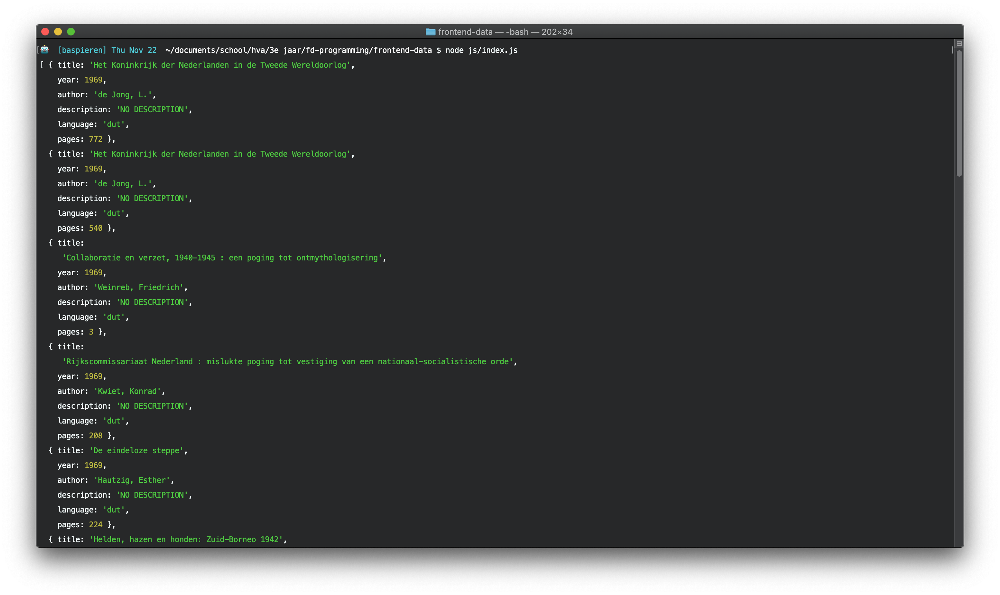
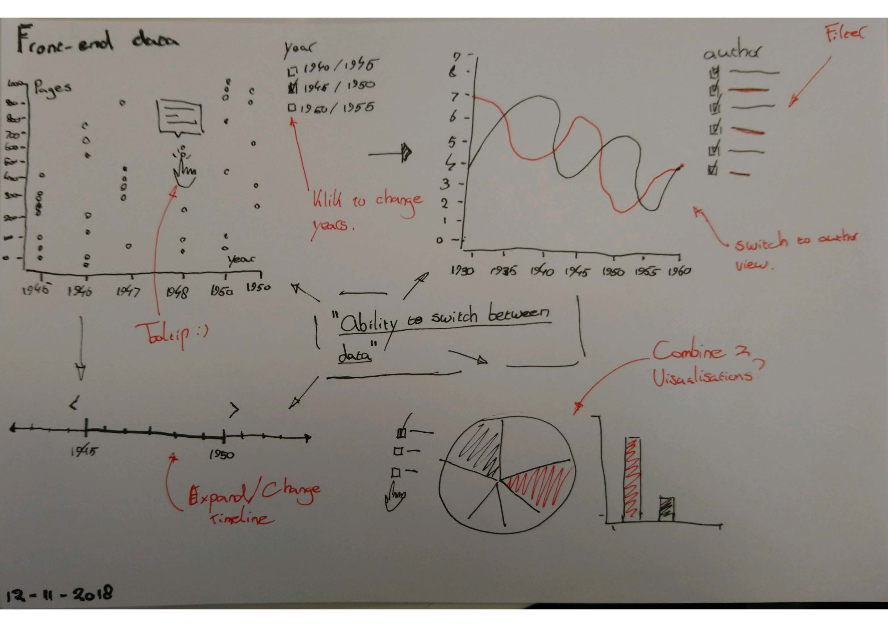
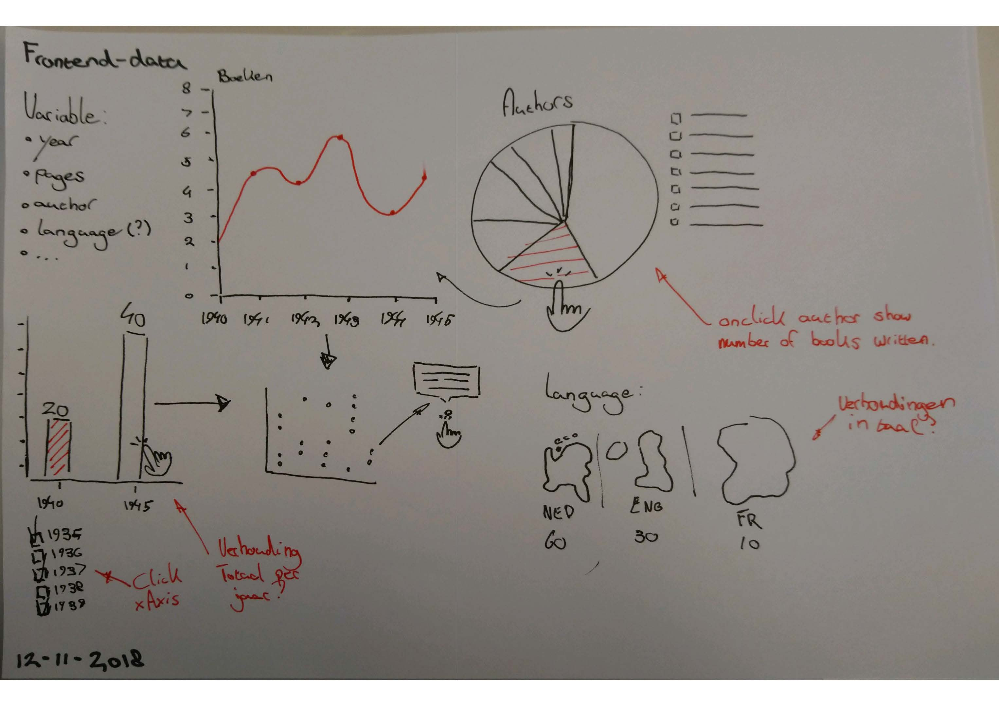
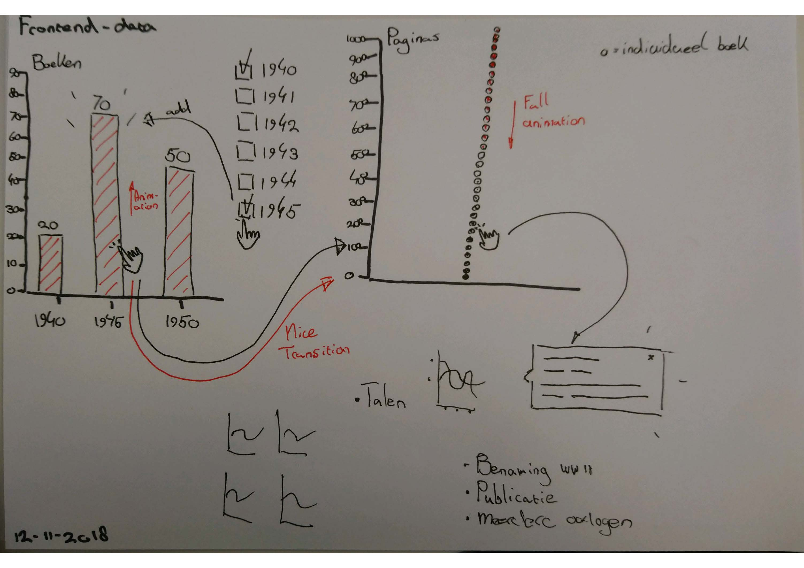
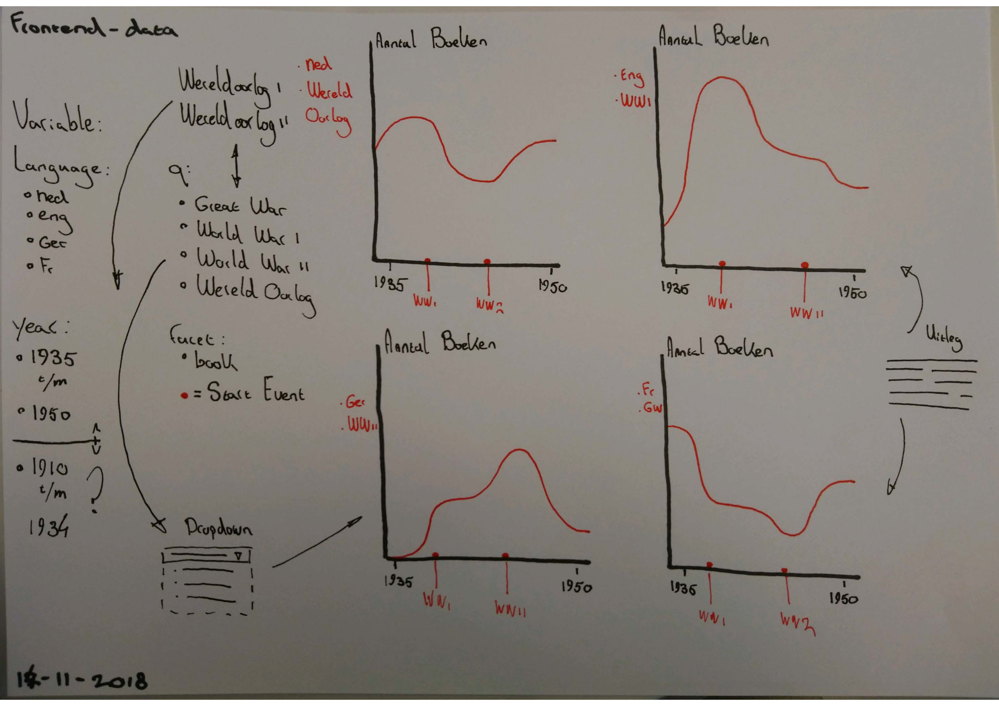
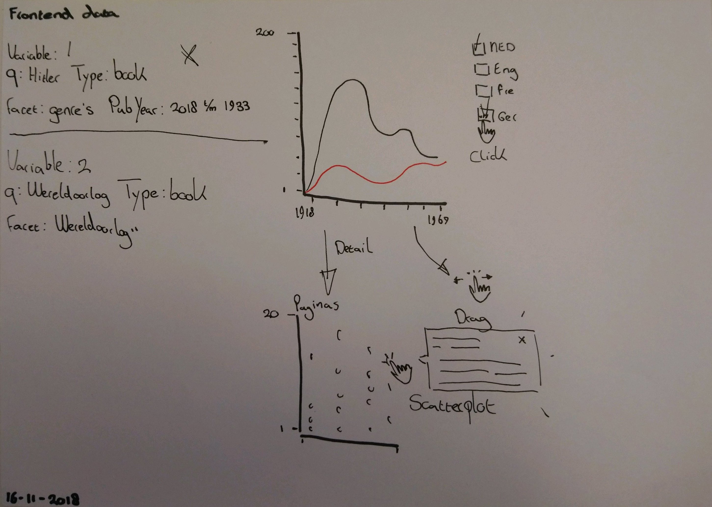
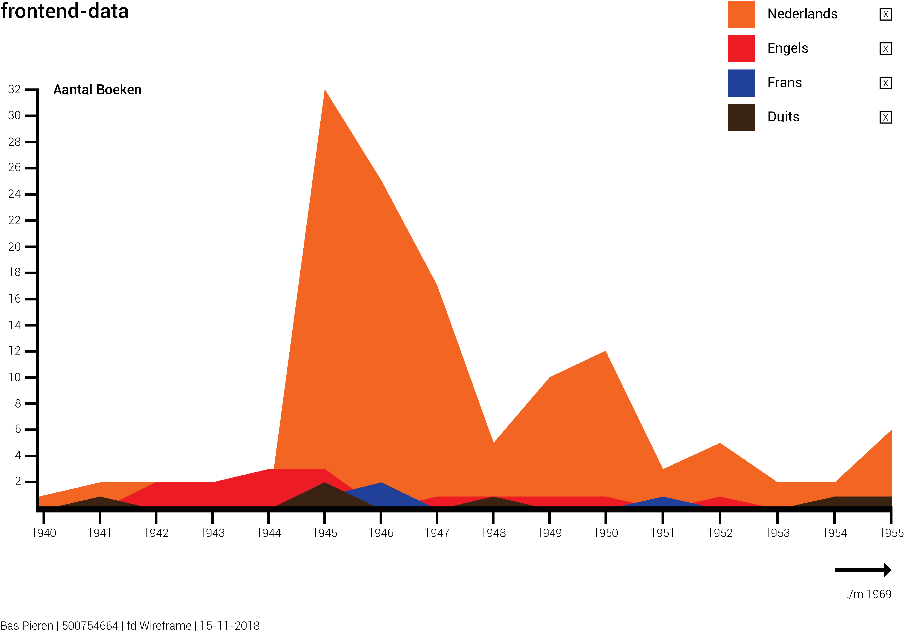
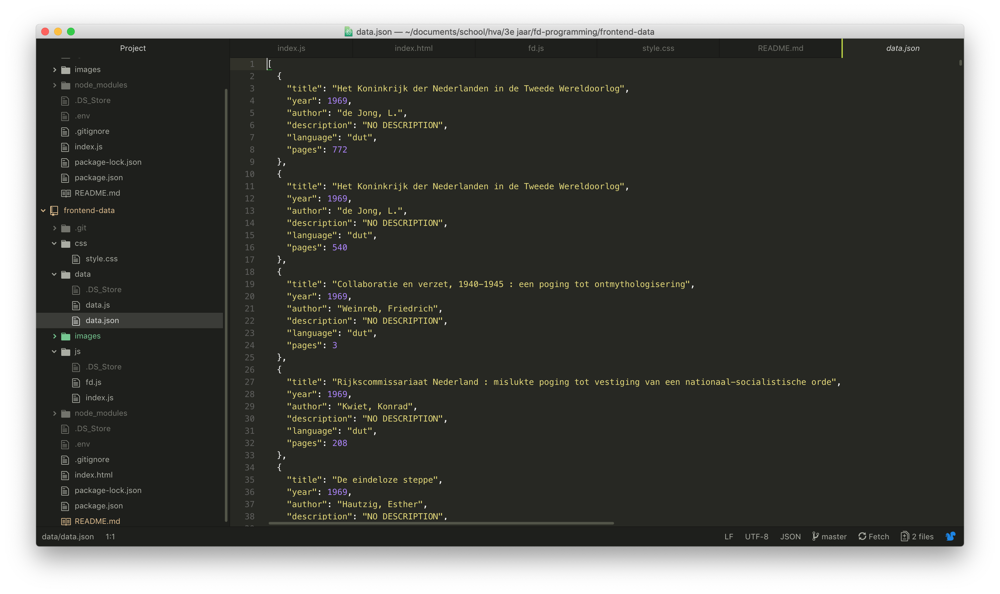

# frontend-data ⚙️

This is the repo for my frontend data project.



## Table of Contents 🗃
* [To Do](#to-do-)
* [Description](#description-)
* [Installing](#installing-)
  * [Packages and technologies](#packages-and-technologies)
* [Research and concepting](#research-and-concepting-)
  * [Data](#data)
  * [Sketches](#sketches)
* [Transform Data](#Transform-data-)
* [Sources](#sources-)
  * [Honourable Mentions](#honourable-mentions)
* [Licence](#licence-)

## To Do 📌
This is a list of things in want to do in this project:
- [X] Git, npm, and d3 are used; the project runs without errors; data is loaded with d3; there is a representation of data
- [X] Data is rendered with d3; interpreting the representation is easier that interpreting the data itself
- [X] d3 is used to clean data and make an interactive representation; Data is transformed
- [ ] Representation and use of a d3 go beyond an example: there are demonstrable additions like well-chosen interaction methods
- [ ] The way the student applies subject matter is more advanced than what they were taught in class; let’s switch places

## Description 📝
During this project I used the d3 javascript library to make a interactive data presentation using data from the OBA API. I looked for interesting patterns of books about World War II.

## Installing 🔍
To install this application enter the following into your terminal:
```
git clone https://github.com/BasPieren/frontend-data.git

cd frontend-data

npm install rijkvanzanten/node-oba-api

npm install
```

### Packages and technologies
This project makes use of the following packages and technologies:

* [OBA API](https://zoeken.oba.nl/api/v1/)
* [node-oba-api](https://github.com/rijkvanzanten/node-oba-api)
* [dotenv](https://www.npmjs.com/package/dotenv)
* [prettier](https://www.npmjs.com/package/prettier)
* [file-system](https://www.npmjs.com/package/file-system)

## Research and concepting 📑
This is the research and concepting work I have done in the first week. I wanted to continue with the concept of using books that where published during World War II.

### Data
Because I wanted to continue with the concept of using books that where published during World War II, I could continue with the data that I already had gathered during [functional-programming](https://github.com/BasPieren/frontend-data) assignment. I did had to change a couple things about how I gathered the data that you can find in the [Transform Data](#Transform-data-) chapter.

The most important thing was to think about what properties I was gonna need. Eventually I settled on the following:

- Title
- Publication Year
- Author
- Description
- Language
- Pages

This is how the data looks in the terminal:



### Sketches
I started making multiple sketches with ideas of how I wanted my data visualisation to look:


> Sketch 1


> Sketch 2


> Sketch 3

I was playing around with the idea of having a data graph transform into a different type of data graph when clicking on an element. I wasn't to sure about what data to use yet. After I got some feedback from [Laurens](https://github.com/Razpudding) I started thinking about using the different languages of books.


> Sketch 4

First I though about giving each language a separate line chart and giving the user the option to sort them between the topics World War I and World War II and show the amount of books that where published each year between a certain timespan that the user would also be able to select. I found that the idea became a bit messy so I decided to streamline it.  


> Sketch 5

Here I combined all separate line charts into one chart and added checkboxes to give the user the option to display the amount of books per different languages as a line on the chart. Then the user would also have the option to see the details of a language in a scatterplot that would show all the separate books with on the x-Axis the publication year and on the y-Axis the number of pages a book would have. The user could then click on a dot and a tooltip would pop up that would display information about that book.

I also refined the visualisation into a wireframe.



## Transform data 🛠
Here I will explain the important parts on how I transformed my data.

_NOTE: The complete code can be found in index.js._

First I installed the [node-oba-api](https://github.com/rijkvanzanten/node-oba-api) made by [Rijk van Zanten](https://github.com/rijkvanzanten) so I could more easily interface with the [OBA API](https://zoeken.oba.nl/api/v1/).

After the installation I modified the `.get` request with some extra parameters to narrow down the books that I would get back.

* `q`: Q allows me to only get books back.
* `refine`: Refine allows me to get more information on a book like genre and type.
* `sort`: Sort allows me to sort the books based on their publication year.
* `facet`: Facet allows me to only get books that have Wereldoorlog II as topic and where published before 1969.
* `page`: Page allows me to navigate trough all the available pages.

```js
client
  .get('search', {
    rctx:
      'AWNkYOZmYGcwrEorS801zTXOLSvMNEyqMEoqN6wyzkpOZWZk4MxNzMxjZGYQT8svyk0ssUrKz8@mBBGMzNKZ8UWpycUFqUUFiemprEYGTAwXQm4Z3DJgalvEyKixTIJ5gwUDA3t$UiIDA2dlamKRon5Rfn6Jfk5mYWlmij5QnL20KIeBNS$HEQA',
    q: 'format:book',
    refine: true,
    sort: 'year',
    facet: ['topic(Wereldoorlog II)', 'pubYearRange(5_OlderThan50)'],
    page: 1
  })
```
Then I wrote three functions that would give me back the correct data. This function maps over the data from the OBA API and saves it inside a new array called `dataStore`. For every book it returns the title, year, author, description, language and pages. For every property I looks if there is a value and, if there is none, replace it with something else. I also made sure that the year and pages would be parsed to be a number instead of a string. We then return `dataStore`.
```js
function filterData(data) {
  let apiResult = data.aquabrowser.results.result
  let dataStore = apiResult.map(e => {
    // START USE OF SOURCE: Jesse Dijkman
    return {
      title: e.titles
        ? e.titles['short-title']
          ? e.titles['short-title'].$t
          : 'No $t-titel'.toUpperCase()
        : 'No titel'.toUpperCase(),

      year: e.publication
        ? e.publication.year
          ? parseInt(e.publication.year.$t, 10)
          : 'No $t-year'.toUpperCase()
        : 'No year'.toUpperCase(),

      author: e.authors
        ? e.authors['main-author']
          ? e.authors['main-author'].$t
          : 'No $t-author'.toUpperCase()
        : 'No author'.toUpperCase(),

      description: e.summaries
        ? e.summaries.summary
          ? e.summaries.summary.$t
          : 'No $t-description'.toUpperCase()
        : 'No description'.toUpperCase(),

      language: e.languages
        ? e.languages.language
          ? e.languages.language.$t
          : 'No $t-language'.toUpperCase()
        : 'No language'.toUpperCase(),

      pages: e.description
        ? e.description['physical-description']
          ? parseInt(
              e.description['physical-description'].$t
                .match(/\d+/g)
                .map(Number),
              10
            )
          : 0
        : 'No physical description'.toUpperCase()
    }
    // END USE OF SOURCE: Jesse Dijkman
  })
  return dataStore
}
```
This function writes the data from the `filterData` function to a data.json file.
```js
function appendData(data) {
  var filteredData = filterData(data)
  // START USE OF SOURCE: Sterre van Geest
  let dataStoreString = JSON.stringify(filteredData)

  fs.appendFile('data/data.json', dataStoreString, err => {
    if (err) throw err
  })
  // END USE OF SOURCE: Sterre van Geest
}
```
The last fucntion uses `console.log` to show the data inside the terminal and calls the `appendData` function.
```js
function getData(data) {
  var filteredData = filterData(data)
  console.log(filteredData)

  appendData(data)
}
```
I knew that there were 16 pages with books. By manualy changing the page number and running the code I was able to write all the data from each page to the data.json file. This wouldn't really be practical if there where a lot more pages. If I had more time I would make sure to fix this.

This is how the data looks as a .json file:



## Sources 📚
* [OBA API](https://zoeken.oba.nl/api/v1/)
* [node-oba-api](https://github.com/rijkvanzanten/node-oba-api)
* [Code provided by Laurens](https://github.com/Razpudding)
* [D3 multi line chart](https://beta.observablehq.com/@mbostock/d3-multi-line-chart)
* [D3.js v4 count values in an object](http://www.shanegibney.com/shanegibney/d3-js-v4-count-values-in-an-object/)
* [D3 change and update axis domain scatterplot](https://stackoverflow.com/questions/43741271/d3-change-and-update-axis-domain-scatterplot)

### Honourable Mentions
* [Readme by Daniel van de Velde](https://github.com/DanielvandeVelde/functional-programming/blob/master/README.md)
* [Code provided by Jesse Dijkman](https://github.com/jesseDijkman1)
* [Code provided by Sterre van Geest](https://github.com/sterrevangeest)

## Licence 🔓
MIT © [Bas Pieren](https://github.com/BasPieren)
